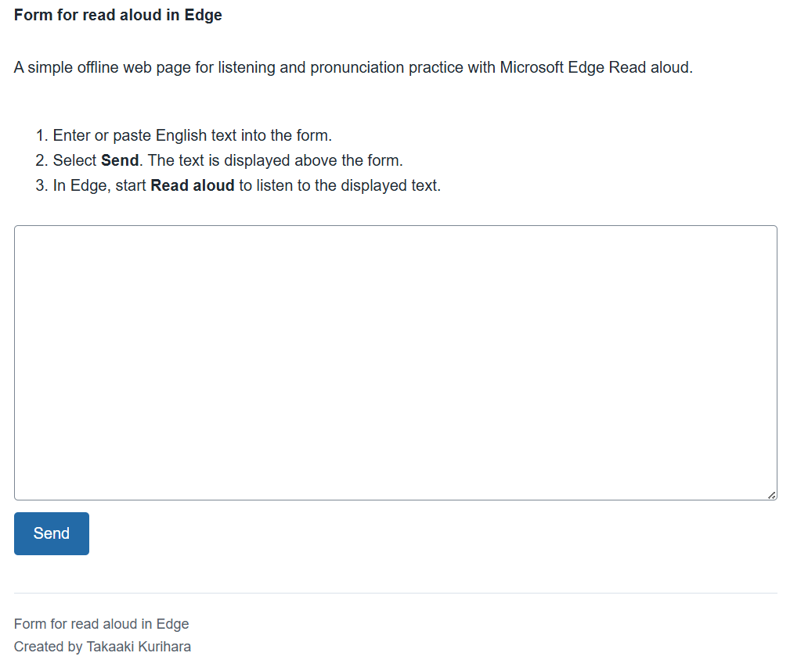
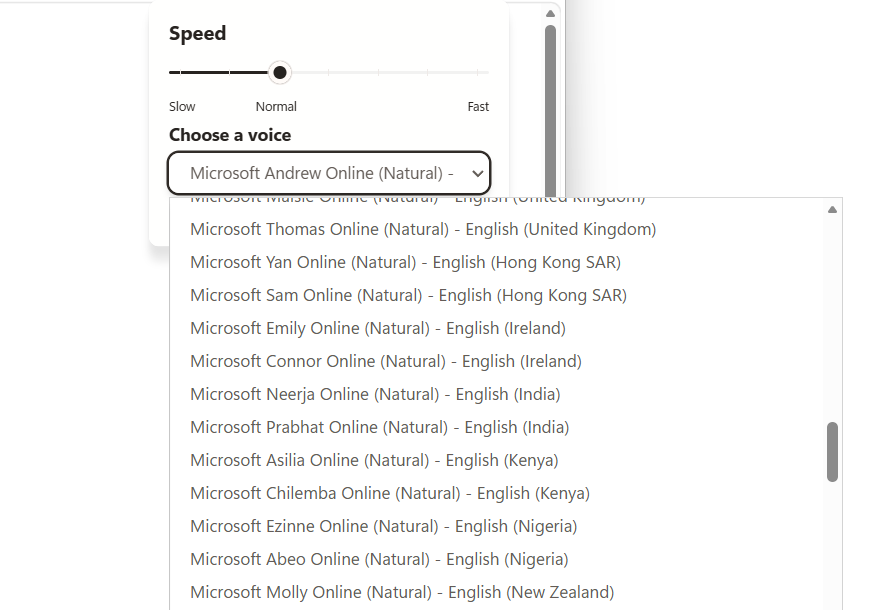

# Form for read aloud in Edge

A simple offline web page for listening and pronunciation practice with Microsoft Edge Read aloud.

## Screenshots

### Screenshots:From

### Screenshots:Read aloud in Edge

### Screenshots:Read aloud in Edge
You can freely adjust the accent and speed in Edge.

## How to use

1. Download https://github.com/kuritaka/form-for-read-aloud-in-edge/archive/refs/heads/main.zip
2. Decompress
3. Open `index.html` in Microsoft Edge.
4. Enter or paste English text into the form.
5. Select **Send**. The text is displayed above the form.
6. In Edge, start **Read aloud** to listen to the displayed text.

## Features

- A 10-row text form
- Submitted text appears above the form
- Centered layout with a maximum width of 780px
- Footer credit
- Fully offline: no external CSS, JavaScript, fonts, or network requests

## Files

- `index.html` - Page structure
- `styles.css` - Local styles
- `script.js` - Form behavior

## License

This project is available for personal use.
